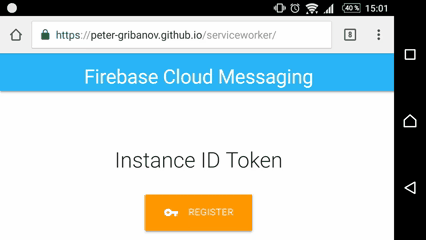

# Test Firebase Cloud Messaging

You can test usage on page: https://peter-gribanov.github.io/serviceworker/



## Send notification from HTTP client

```
POST /fcm/send HTTP/1.1
Host: fcm.googleapis.com
Authorization: key=AAAAaGQ_q2M:APA91bGCEOduj8HM6gP24w2LEnesqM2zkL_qx2PJUSBjjeGSdJhCrDoJf_WbT7wpQZrynHlESAoZ1VHX9Nro6W_tqpJ3Aw-A292SVe_4Ho7tJQCQxSezDCoJsnqXjoaouMYIwr34vZTs
Content-Type: application/json

{
  "notification": {
    "title": "Bubble Nebula",
    "body": "It's found today at 21:00",
    "icon": "https://peter-gribanov.github.io/serviceworker/Bubble-Nebula.jpg",
    "click_action": "https://www.nasa.gov/feature/goddard/2016/hubble-sees-a-star-inflating-a-giant-bubble"
  },
  "to": "YOUR-TOKEN-ID"
}
```
